# 🎓 Face Recognition Attendance System

A desktop attendance management application that uses real-time face recognition to mark student attendance automatically. Built with **Python, OpenCV, DeepFace, and Tkinter**, with attendance records stored in **SQLite** and exportable to **CSV**.


---

## 📸 Demo

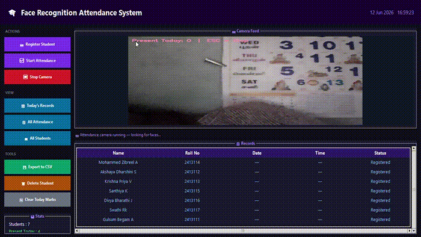

---

## ✨ Features

- 🧑‍🎓 **Register Students** — Add new students with name, roll number, and a captured face photo
- 🎥 **Live Camera Feed** — Real-time face detection and recognition via webcam
- ✅ **Automatic Attendance Marking** — Detects and recognizes faces, marks attendance instantly
- 📅 **Today's Records** — View a quick summary of who's present today
- 📊 **All Attendance** — Browse the complete attendance history
- 👥 **All Students** — View the full list of registered students
- 📤 **Export to CSV** — One-click export of attendance data for reporting
- 🗑️ **Delete Student** — Remove a student and their records with confirmation
- 🧹 **Clear Today's Marks** — Reset today's attendance with a safety confirmation
- 📈 **Live Stats Panel** — Shows total students and number present today

---

## 🖥️ Application Walkthrough

### 🏠 Home Screen
The main dashboard showing the camera feed, action buttons, and live attendance records.

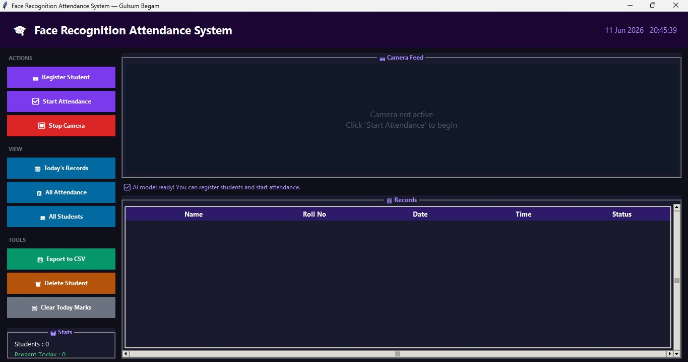

### ➕ Registering a New Student

**Step 1 — Enter Name**

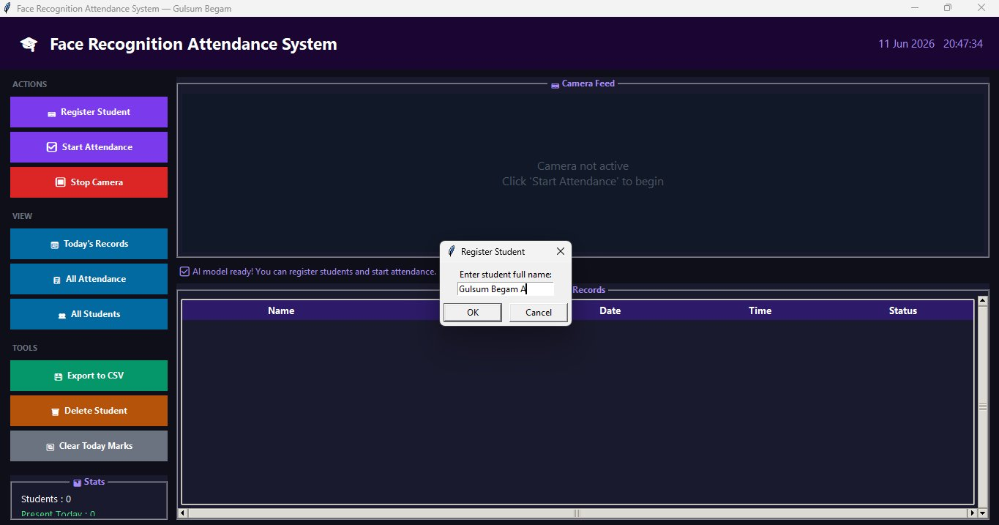

**Step 2 — Enter Roll Number / ID**


**Step 3 — Capture Instructions**

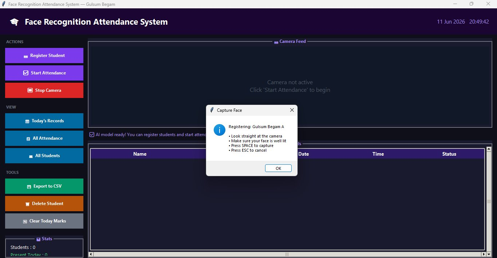

**Step 4 — Face Capture**

The system detects the face in real time and captures it for recognition training.

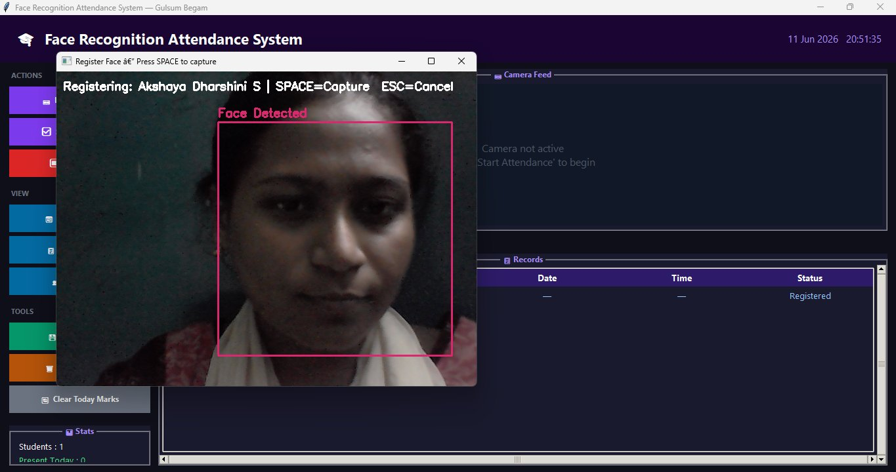

### 🎯 Live Face Recognition & Attendance Marking

Once attendance starts, the system recognizes registered faces and marks them present automatically.

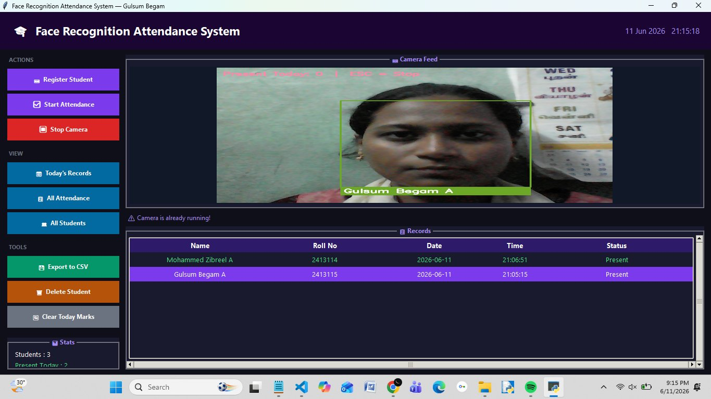

### 📅 Today's Records

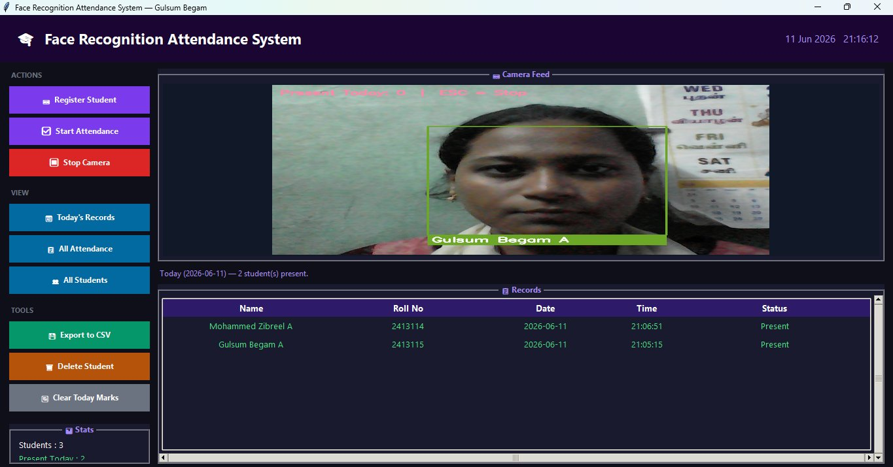

### 📊 All Attendance History

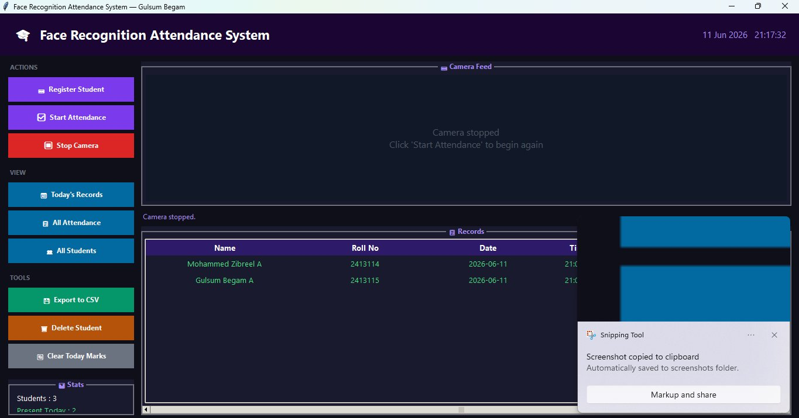

### 👥 All Registered Students

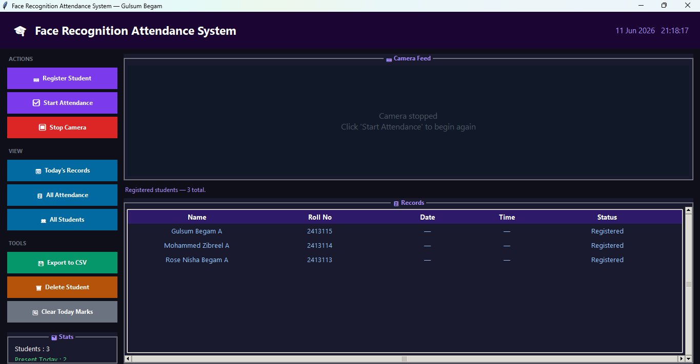

### 📤 Export to CSV

Attendance data can be exported to a CSV file with a single click.

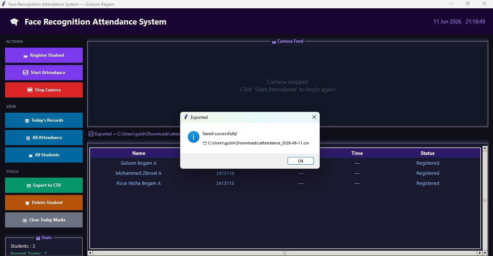

### 🗑️ Delete Student

**Step 1 — Enter Roll Number**

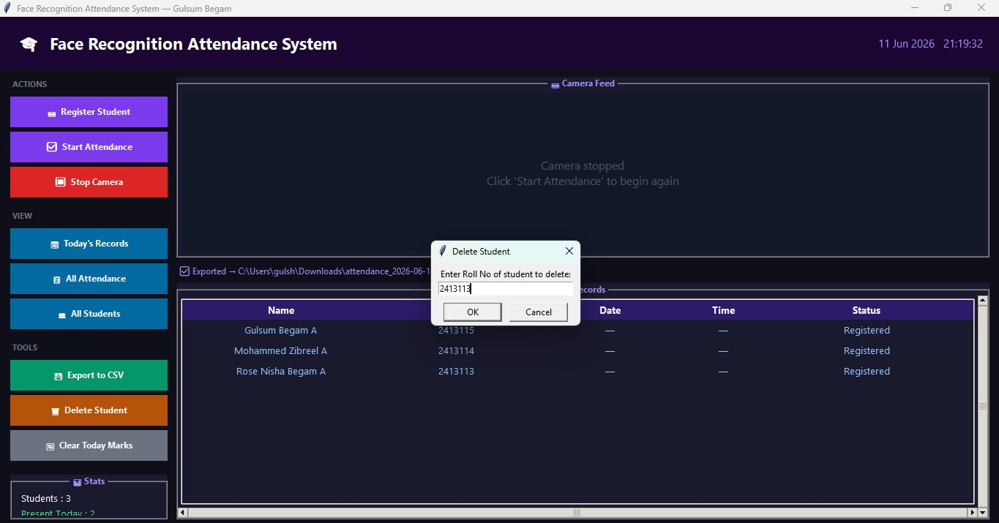

**Step 2 — Confirm Deletion**

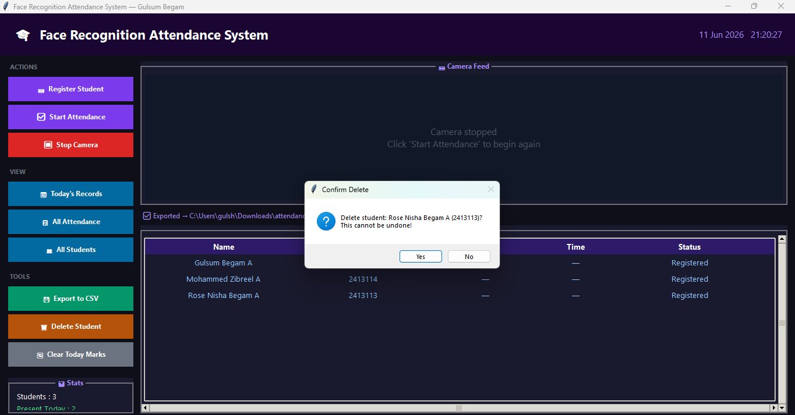

### 🧹 Clear Today's Attendance

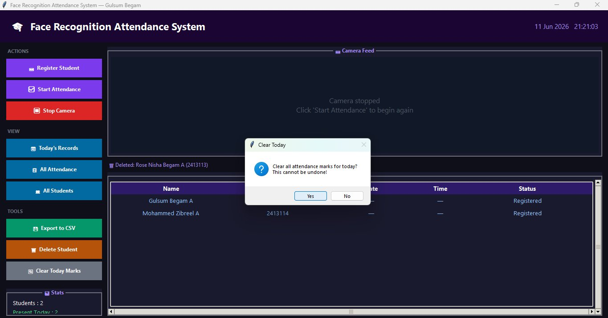

---

## 🛠️ Tech Stack

| Technology | Purpose |
|---|---|
| **Python** | Core programming language |
| **OpenCV (cv2)** | Camera access, face detection, image processing |
| **DeepFace** | Deep learning-based face recognition |
| **TensorFlow / Keras (tf-keras)** | Backend for DeepFace models |
| **Tkinter** | GUI framework |
| **Pillow (PIL)** | Image handling for the GUI |
| **SQLite3** | Local database for students & attendance |
| **NumPy** | Numerical operations on image arrays |
| **CSV** | Attendance export |

---

## ⚙️ Installation

1. **Clone the repository**
   ```bash
   git clone https://github.com/<your-username>/face-recognition-attendance-system.git
   cd face-recognition-attendance-system
   ```

2. **Install the required dependencies**
   ```bash
   pip install opencv-python pillow numpy deepface tensorflow tf-keras
   ```

3. **Run the application**
   ```bash
   python face_attendance.py
   ```

---

## 🚀 Usage

1. Click **Register Student** to add a new student — enter their name, roll number, and capture their face.
2. Click **Start Attendance** to activate the camera and begin recognizing faces in real time.
3. Recognized students are automatically marked **Present** for the day.
4. Use **Today's Records**, **All Attendance**, or **All Students** to view data.
5. Click **Export to CSV** to save attendance records for the day.
6. Use **Delete Student** or **Clear Today Marks** for management/admin tasks.

---

## 📁 Project Structure

```
face-recognition-attendance-system/
├── face_attendance.py        # Main application file
├── attendance.db              # SQLite database (auto-created)
├── student_images/            # Captured face images
├── attendance_YYYY-MM-DD.csv  # Exported attendance reports
└── README.md
```

---

## 👩‍💻 Author

**Gulsum Begam A**

⭐ If you found this project useful, consider giving it a star!
